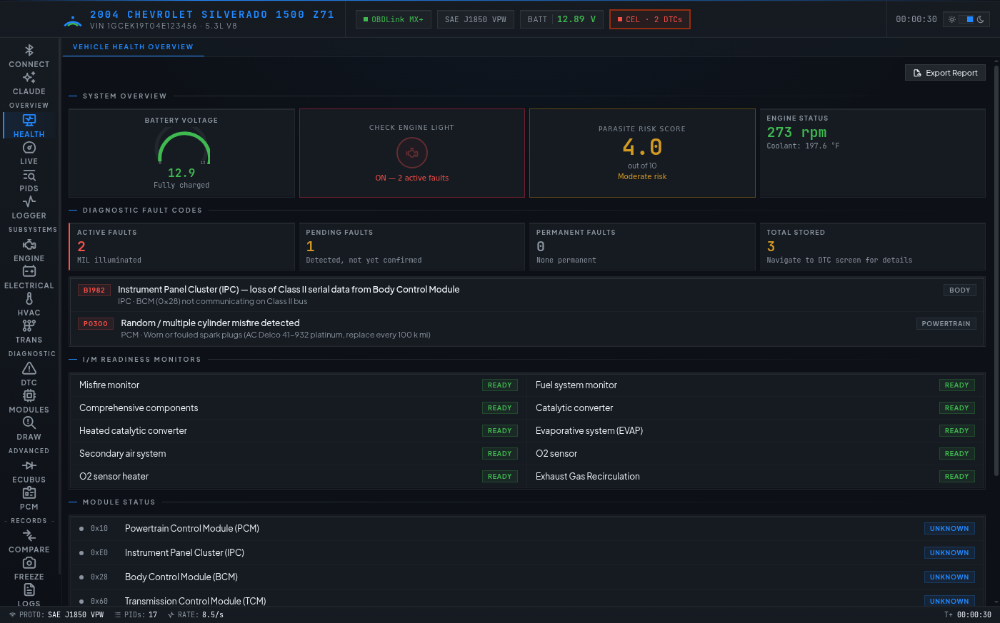
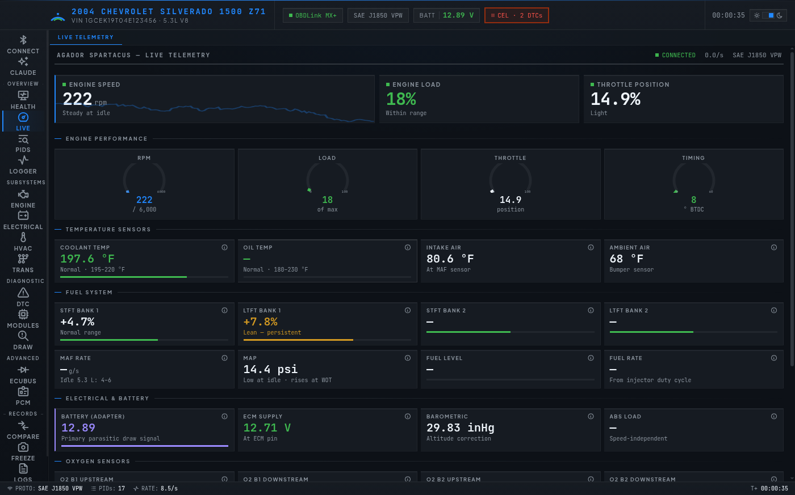
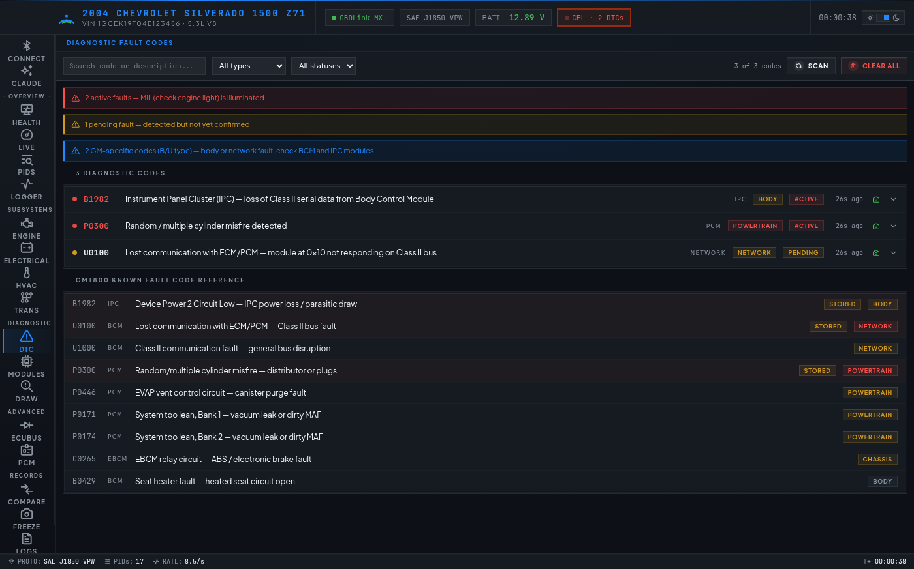
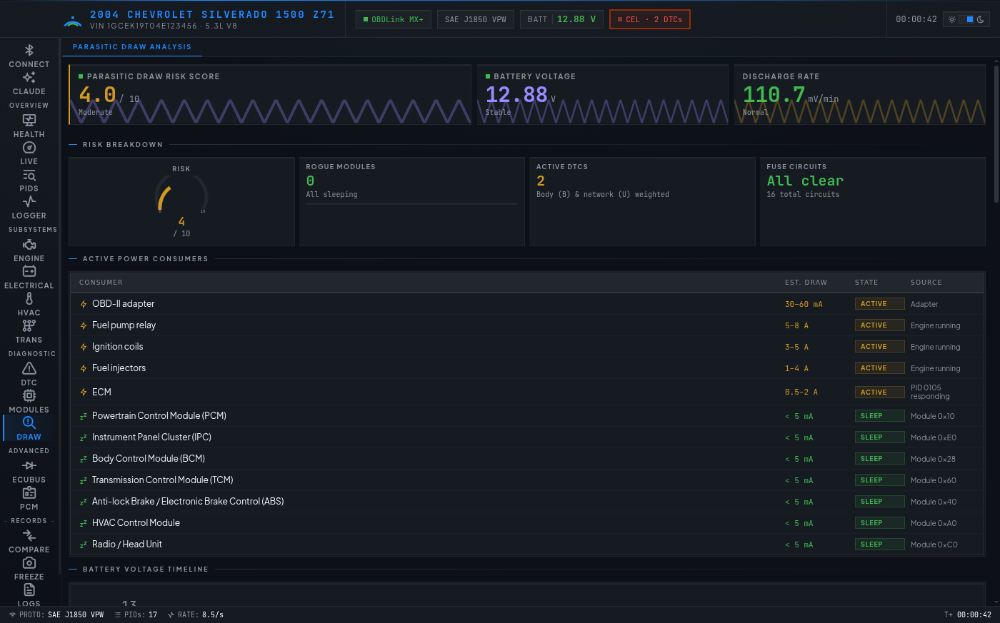
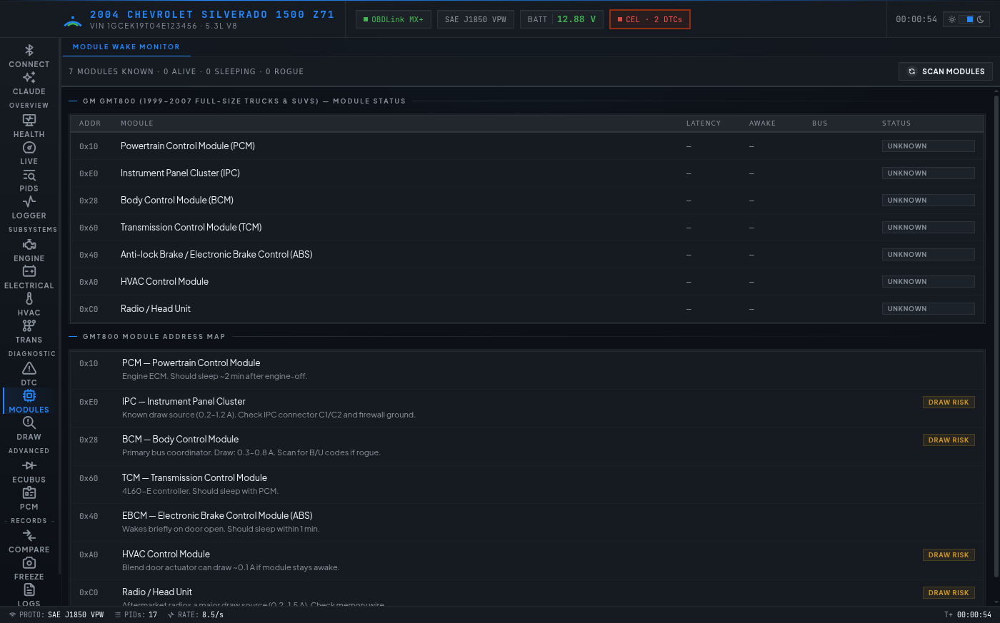

# Project Agador Spartacus

**An OBD-II diagnostic suite for the desktop — live telemetry, fault codes, parasitic-draw analysis, and a Claude-powered diagnostic assistant.**

Built as an Electron + React + TypeScript application that talks to an ELM327-class adapter over Bluetooth or USB serial. It started as a targeted tool for chasing a parasitic battery drain on a 2004 Chevrolet Silverado 1500 Z71 (GM GMT800, J1850 VPW), and has since been generalized: the protocol layer works against any OBD-II vehicle, with platform-specific reference data (module maps, fuse panels, draw checklists) resolved from a registry.

The app runs fully offline against a built-in ELM327 simulator, so no vehicle or adapter is required for development.

---

## Screenshots

All captured from the built-in simulator — no vehicle or adapter required to see them.

| | |
|---|---|
| **Vehicle health overview** — battery voltage, parasite risk score, I/M readiness monitors, adapter/protocol status at a glance |  |
| **Live telemetry** — RPM, load, throttle and timing gauges, plus temperature, fuel trim, and electrical readings updating in real time |  |
| **Diagnostic fault codes** — active/pending/permanent DTCs cross-referenced against the GMT800 known-fault-code table |  |
| **Parasitic draw analysis** — risk score, active power consumers with estimated draw, and a live battery voltage timeline |  |
| **Module wake monitor** — per-module address, latency, awake/asleep state, and known draw-risk annotations |  |

---

## Table of contents

- [Screenshots](#screenshots)
- [Features](#features)
- [Screens](#screens)
- [Architecture](#architecture)
- [Repository layout](#repository-layout)
- [Getting started](#getting-started)
- [Running against real hardware](#running-against-real-hardware)
- [Running in Docker (headless)](#running-in-docker-headless)
- [Testing](#testing)
- [The automated review pipeline](#the-automated-review-pipeline)
- [Hardware](#hardware)
- [Security notes](#security-notes)
- [Documentation](#documentation)
- [Attribution and licensing](#attribution-and-licensing)

---

## Features

**Live diagnostics**
- Sequential PID polling loop with three priority tiers — battery voltage and fast PIDs (RPM, ECM voltage) every cycle, normal PIDs every 3rd cycle, slow PIDs every 10th. Commands never overlap on the serial line.
- 34-PID catalog with SAE J1979 decode formulas, ranges, units, and plain-English descriptions.
- Telemetry ingest buffer decouples wire rate from render rate: samples are absorbed at adapter speed and committed to React on a fixed interval, with unchanged values dropped before they leave the buffer.
- VIN detection and decode, with automatic vehicle profile population.

**Fault codes**
- DTC scan / clear across all supported modes, with a 371-entry generated code catalog.
- Freeze-frame capture and viewer, persisted per DTC.
- Optional CarsXE lookup for code descriptions, likely causes, and repair guidance.

**Parasitic draw suite**
- Module wake monitor — polls known module addresses after key-off to find the one staying awake.
- Battery voltage timeline over long sessions.
- Interactive fuse map (interior panel + under-hood fuse/relay center), ordered by draw likelihood.
- Step-by-step draw isolation protocol driven by the resolved platform profile.

**GM-specific**
- Read-only PCM identity over J1850 VPW Mode 3C — VIN, hardware/software IDs, calibration and segment info from GM P01/P59-family PCMs.

**Records and reporting**
- CSV / JSON data logger with recording playback.
- Session snapshots, live-vs-historic compare with overlay.
- HTML/PDF report generation.
- Pluggable storage backend: flat JSON file or SQLite (`better-sqlite3`), migratable in-app.

**Claude assistant**
- In-app chat that receives a snapshot of the live session (current PIDs, active DTCs, recent log) as context.
- Model selectable in Settings; streaming responses; chat exportable to Markdown.
- API key stored in the app's `userData` directory and encrypted at rest via the OS keychain (Electron `safeStorage`).

---

## Screens

19 screens, grouped in the sidebar:

| Group | Screens |
|---|---|
| — | **Connect** (port list, RSSI, protocol negotiation) · **Claude** (diagnostic assistant) |
| Overview | **Health** · **Live** · **PIDs** (full parameter browser) · **Logger** |
| Subsystems | **Engine** · **Electrical** · **HVAC** · **Trans** |
| Diagnostic | **DTC** · **Modules** · **Draw** (parasitic analysis) |
| Advanced | **EcuBus** (CAN/UDS tooling) · **PCM** (powertrain module identity) |
| Records | **Compare** · **Freeze** · **Logs** · **Settings** |

Theme: McLaren Technology Centre — papaya and Gulf blue on a near-black ground.

---

## Architecture

```
┌─────────────────────────────────────────────────────────────────────┐
│ Renderer (React 18 + Zustand)                                       │
│                                                                     │
│   19 screens ── appStore ◄── TelemetryBuffer ◄── IPC events         │
│                                (batches at display rate)            │
└────────────────────────────┬────────────────────────────────────────┘
                             │ contextBridge (contextIsolation: true)
┌────────────────────────────▼────────────────────────────────────────┐
│ Main process (Electron)                                             │
│                                                                     │
│   OBDProtocolManager ── poll loop, DTC scan, module wake check      │
│           │                                                         │
│   ELM327Commander ── AT command engine, timeouts, response framing  │
│           │                                                         │
│   ObdTransport (interface) ──┬── SerialTransport   (real adapter)   │
│                              └── SimulatorTransport (offline)       │
│                                                                     │
│   StorageService · claudeAssistant · PcmDiagnostics                 │
└─────────────────────────────────────────────────────────────────────┘
```

Three seams do most of the structural work:

**`ObdTransport`** (`src/core/transport.ts`) — the link, and nothing else: no protocol knowledge, no framing, no ELM327 semantics. `open`/`close`/`write` all return promises that reject on failure, so a dead port fails fast instead of burning the full command timeout, and `onClose`/`onError` let the commander learn the link died. The same commander drives a serial port, the simulator, and (if hardware ever justified it) a BLE GATT link unchanged. It also makes the whole protocol stack testable without launching Electron.

**`normalizeElmResponse`** (`src/core/elmFraming.ts`) — the ELM327 does its own ISO-TP reassembly but prints the result as a length header plus one `0:`/`1:`-prefixed line per segment. Naïvely stripping whitespace and concatenating mixes those prefixes into the payload and corrupts every downstream parse. Everything that reads a response body goes through this first. Test fixtures cover chunk boundaries falling at arbitrary offsets, since a real link splits reads anywhere and a BLE notification is capped at the ATT MTU with no alignment to the `>` prompt.

**`PlatformProfile`** (`src/core/platforms/`) — the app is vehicle-agnostic at the protocol level, but module address maps, fuse layouts, and draw checklists are platform-specific. A registry resolves the most specific profile for the detected vehicle (`gmt800`, then `generic`), never returning undefined.

### ELM327 initialization sequence

```
ATZ      Reset adapter, clear all state
ATE0     Echo off
ATL0     Linefeed off
ATH0     Headers off
ATS0     Spaces off
ATSP0    Auto protocol detection
ATAT1    Adaptive timing level 1
010C     Protocol ping — forces protocol lock (J1850 VPW on GMT800)
ATDP     Read negotiated protocol
STI      OBDLink firmware version
STDI     OBDLink device info
ATRV     Live battery voltage
```

---

## Repository layout

```
.
├── files/                          # The application
│   ├── src/
│   │   ├── main/                   # Electron main process
│   │   │   ├── main.ts             #   window, IPC handlers, session state
│   │   │   ├── preload.ts          #   contextBridge API surface
│   │   │   ├── serialTransport.ts  #   ObdTransport over node-serialport
│   │   │   ├── storageService.ts   #   JSON + SQLite backends, migration
│   │   │   └── claudeAssistant.ts  #   Claude API bridge, encrypted key store
│   │   ├── core/                   # Protocol layer (no Electron imports)
│   │   │   ├── transport.ts        #   ObdTransport seam + test chunkers
│   │   │   ├── simulatorTransport.ts
│   │   │   ├── elm327Commander.ts  #   AT engine, timeouts, retries
│   │   │   ├── elm327Simulator.ts  #   offline 2004 Silverado session
│   │   │   ├── elmFraming.ts       #   multi-line / segmented response framing
│   │   │   ├── obdProtocolManager.ts #  poll loop, DTC scan, wake check
│   │   │   ├── pidCatalog.ts       #   36 PIDs, J1979 decode functions
│   │   │   ├── dtcCatalog.generated.ts # 371 codes (see scripts/gen-dtc-catalog.ts)
│   │   │   ├── pcmDiagnostics.ts   #   GM Mode 3C identity read (read-only)
│   │   │   └── platforms/          #   gmt800 · generic · registry
│   │   ├── renderer/
│   │   │   ├── App.tsx             #   shell, nav, IPC wiring
│   │   │   ├── screens/            #   19 screens
│   │   │   ├── store/appStore.ts   #   Zustand global state
│   │   │   ├── telemetry/          #   TelemetryBuffer
│   │   │   ├── theme/theme.ts      #   CSS vars, gauge geometry
│   │   │   └── components/         #   Card, MetricTile, ArcGauge, ErrorBoundary…
│   │   └── shared/types.ts         # Types shared across the IPC boundary
│   ├── tests/                      # node:test suites
│   ├── scripts/gen-dtc-catalog.ts  # DTC catalog generator
│   ├── docker/                     # Dockerfile + Xvfb/noVNC entrypoint
│   └── assets/report.html          # PDF report template
├── eval/                           # Automated review harness (see below)
│   └── {security,deps,architecture,performance,quality,tests}/
├── docs/superpowers/               # Design specs and implementation plans
├── docker-compose.yml              # Headless container with noVNC on :6080
├── HARDWARE_SOFTWARE_COMPATIBILITY_REVIEW.md
├── README_SILVERADO_DX_PROJECT.md  # Original hardware/procurement doc set
└── shopping-list.html              # Parts list with retailer sourcing
```

---

## Getting started

### Prerequisites

- **Node.js 18+** (22 recommended — the container builds on `node:22-bookworm`)
- **macOS 13 Ventura or later** for the packaged app; Linux works for development and via Docker
- Build toolchain for native modules (`serialport`, `better-sqlite3`) — Xcode Command Line Tools on macOS (`xcode-select --install`), or `python3 make g++` on Debian/Ubuntu

### Install and run

```bash
git clone git@github.com:jmjohns9/agador-spartacus.git
cd agador-spartacus/files
npm install
npm run dev
```

`npm run dev` runs three concurrent processes: `tsc --watch` for the main process, `webpack --watch` for the renderer bundle, and `electron .` once `dist/main/main.js` exists.

**The app starts in simulator mode — no adapter needed.** The simulator emulates a 2004 Silverado J1850 VPW session:

- Battery voltage stepping 12.89 V → 11.8 V over four hours, reproducing a parasitic drain
- Instrument cluster staying awake after engine-off, reproducing the known GMT800 fault
- Pre-loaded DTCs: `B1982`, `P0300`, `U0100`
- Realistic noise on every sensor reading

### Scripts

| Command | What it does |
|---|---|
| `npm run dev` | Watch-mode development with hot reload |
| `npm run build` | Compile main process + bundle renderer |
| `npm run dist` | Build and package a macOS `.dmg` / `.zip` via electron-builder |
| `npm run typecheck` | `tsc --noEmit` across the project |
| `npm test` | Compile and run the `node:test` suites |
| `npm run gen:dtcs` | Regenerate `dtcCatalog.generated.ts` |

---

## Running against real hardware

The reference adapter is the **OBDLink MX+** (Bluetooth Classic, ELM327 v1.5 superset, GM-LAN + J1850 VPW, extended `STx` commands). Any ELM327-class adapter that presents as a serial port should work; `STx`-dependent features degrade gracefully.

**macOS (Bluetooth):**

1. Plug the adapter into the OBD-II port; ignition ON (engine optional).
2. Pair it under **System Settings → Bluetooth** (PIN `1234` for HC-05-based builds).
3. Find the port: `ls /dev/tty.* | grep -i obd` — typically `/dev/tty.OBDII` or `/dev/tty.OBDLink-MXPlus-Port`.
4. Open the **Connect** screen in the app and pick the port from the list. Detected OBD adapters are flagged in the picker.

**Linux (USB serial):** the adapter appears as `/dev/ttyUSB0` or `/dev/ttyACM0`. Add your user to the `dialout` group.

---

## Running in Docker (headless)

The container runs the full Electron GUI under Xvfb and exposes it over noVNC — useful for CI, for a headless shop machine, or for driving the app from a browser.

```bash
docker compose up --build
# then open http://<host>:6080/vnc.html
```

Details worth knowing:

- `/dev` is live-mounted so an adapter hot-plugged after startup is visible without a restart.
- `device_cgroup_rules` grant access to USB-serial (`c 188:*`) and CDC-ACM (`c 166:*`) character devices; the container joins `dialout`.
- App data (`storage.db`, `storage.json`) persists in the `obd-data` volume mounted at `/root/.config`.
- The image rebuilds **only** `better-sqlite3` and `serialport` against Electron's ABI. electron-builder's default full-tree rebuild also hits `ttf2woff2`, a dev-only transitive dep of the icon tooling whose nan-based addon does not compile against Electron 42's V8.

---

## Testing

```bash
cd files && npm test
```

Suites under `files/tests/`:

| Suite | Covers |
|---|---|
| `framing.test.ts` | `normalizeElmResponse` — segmented replies, status tokens (`SEARCHING...`, `BUS INIT`), arbitrary chunk boundaries |
| `commander.test.ts` | ELM327 command engine against a simulated transport under every delivery profile (whole-response, fixed MTU, pinned offsets) |
| `pidDecode.test.ts` | J1979 decode formulas across the PID catalog |
| `telemetryBuffer.test.ts` | Ingest/commit batching, unchanged-value suppression, timer lifecycle |

The transport seam is what makes these possible — every one runs without launching Electron or touching a serial port.

---

## The automated review pipeline

`eval/` holds a scored, self-checking code review harness. Six review types run on a schedule against `files/src`:

| Type | Cadence |
|---|---|
| `security` | daily |
| `deps` | daily |
| `quality` | weekly |
| `performance` | weekly |
| `tests` | weekly |
| `architecture` | monthly |

Each `eval/<type>/` directory contains:

- **`review-<type>.md`** — the review prompt itself, defining a closed-set finding taxonomy, explicit non-findings, and the required JSON output shape.
- **`expected.json`** — the answer key: findings a correct review should surface.
- **`history/<YYYY-MM-DD>.json`** — one file per run, committed.
- **`score.py`** — scores a run against the key. Findings match on exact fingerprint first, then fall back to category + file + line proximity, with alias sets for categories that name the same defect family from different vantage points (`prompt_injection` ≈ `injection_via_untrusted_peripheral`, `missing_csp` ≈ `electron_hardening`) and line-tolerant handling for defects that span an IPC handler and its callee. Prints recall by severity, severity-match rate, and false-positive rate.
- **`last-run-summary.md`** — human-readable digest, with new findings deduped against the previous run by fingerprint.

Runs are path-scoped commits (`review: security 2026-08-10 (2 new)`) so unrelated working-tree changes can't be swept in, and the review never reads `expected.json` or prior history — that would bias the result.

---

## Hardware

Two validated procurement paths. Full analysis in [`HARDWARE_SOFTWARE_COMPATIBILITY_REVIEW.md`](HARDWARE_SOFTWARE_COMPATIBILITY_REVIEW.md); parts and retailer sourcing in [`shopping-list.html`](shopping-list.html).

| | Path A — OBDLink MX+ | Path B — DIY STN1110 + HC-05 |
|---|---|---|
| Cost | $110–135 | $210–240 (breadboard) |
| Lead time | 2–3 days | 10–14 days + 2–3 hrs assembly |
| Setup | None — works out of box | Mandatory HC-05 AT-mode config + LM2596 calibration |
| Protocols | J1850 VPW, GM-LAN, extended `STx` | J1850 VPW, standard OBD-II (no `STx`) |
| Best for | Immediate diagnostics | Learning electronics, redundant adapter |

**Do not use:** AliExpress/eBay STN1110 clones (counterfeit chips), HC-05 modules without an AT-mode button (baud rate can't be reconfigured), or the Macchina A0 (CAN-only, incompatible with J1850 VPW). Bench-calibrate any LM2596 to 5.0 V ±0.1 V **before** connecting it to anything.

Approved parts: SparkFun WIG-09555 (genuine STN1110), DSD TECH HC-05 model B076BS39YZ, LYLANMO LM2596.

---

## Security notes

This is a desktop app that ingests data from an untrusted peripheral (the adapter) and from third-party APIs, so the threat model is taken seriously and reviewed daily.

Currently enforced:

- `contextIsolation: true`, `nodeIntegration: false` on the main window; all privileged operations go through explicit IPC handlers.
- Claude API key encrypted at rest via `safeStorage`, with a documented plaintext-migration path for configs written before encryption existed, and `0600` enforced on rewrite.
- Bounded adapter input on the ELM327 receive path.
- Report data escaped before it reaches `innerHTML`.
- Session log capped as a ring buffer (5000 entries) so long-lived sessions don't grow unboundedly.

Known open findings are tracked in `eval/security/last-run-summary.md` rather than hidden — as of the last run: 7 medium, 7 low, covering DoS bounds on adapter-controlled parsing, prompt-injection fencing in the assistant context, Electron sandbox hardening, and rate limiting on metered third-party proxies.

**The PCM surface is read-only by design.** PcmHammer's reason for existing is flashing — kernel upload, segment write, recovery. None of that is implemented here, because a diagnostics tab has no business holding a write primitive that can brick an ECU.

---

## Documentation

| Document | Contents |
|---|---|
| [`HARDWARE_SOFTWARE_COMPATIBILITY_REVIEW.md`](HARDWARE_SOFTWARE_COMPATIBILITY_REVIEW.md) | Section-by-section protocol review, commander code validation, Bluetooth specifics, appendices |
| [`README_SILVERADO_DX_PROJECT.md`](README_SILVERADO_DX_PROJECT.md) | Original hardware/procurement doc index, decision matrices, troubleshooting |
| [`OBD2_Mac_App_Prompt.md`](OBD2_Mac_App_Prompt.md) | Full original application specification |
| [`DELIVERABLES_MANIFEST.txt`](DELIVERABLES_MANIFEST.txt) | Deliverable inventory |
| `docs/superpowers/specs/` | Design specs |
| `docs/superpowers/plans/` | Implementation plans |

> `files/README.md` is the original app-level README and predates the transport seam, the platform registry, and the Connect screen. This root README is the current reference.

---

## Attribution and licensing

- GM PCM Mode 3C block IDs and request/response framing in `pcmDiagnostics.ts` are derived from **PcmHammer** (GPL-3.0) — `Apps/PcmLibrary/Messages/BlockId.cs` and `Docs/Read_ID_Commands.txt`.
- PID decode formulas follow **SAE J1979**; the GMT800 bus behavior follows **SAE J1850 VPW**.
- The Claude assistant uses the [Anthropic API](https://docs.anthropic.com) via `@anthropic-ai/sdk`. You supply your own API key.

---

## Safety

Diagnostic work on a vehicle carries real risk. Do not read live data while driving. Clearing DTCs erases freeze-frame data and readiness monitors — capture a report first. Verify any voltage source with a multimeter before connecting it to the OBD-II port. Nothing in this app writes to a control module, and it should stay that way.
