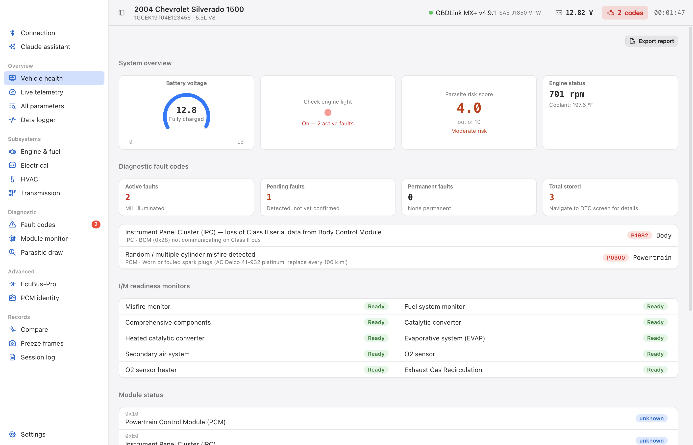
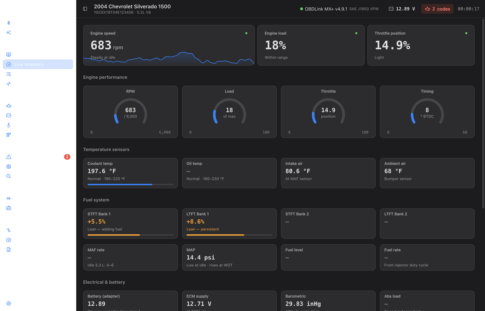
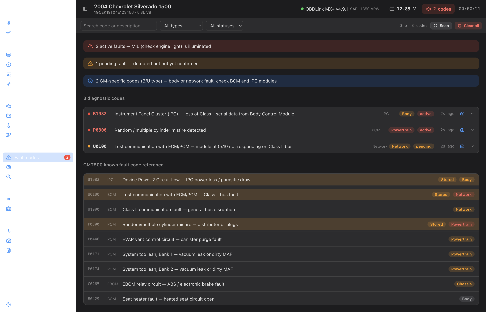
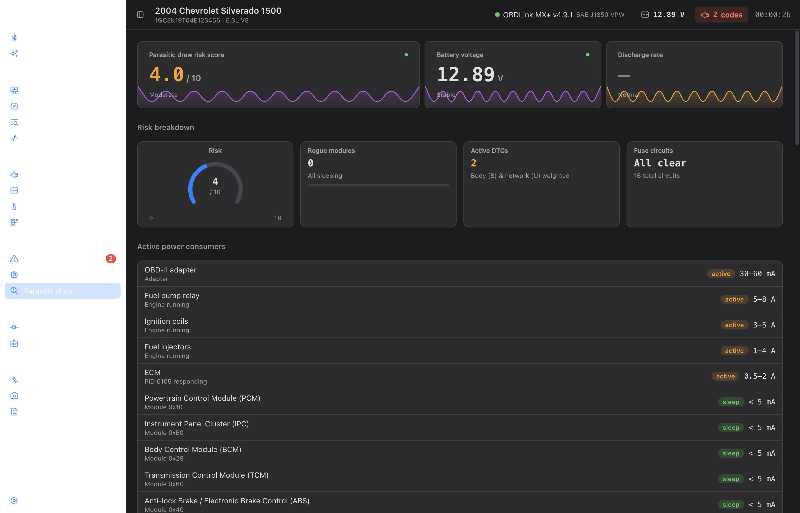
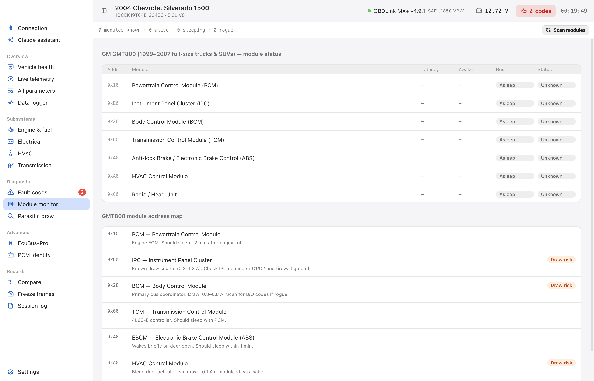
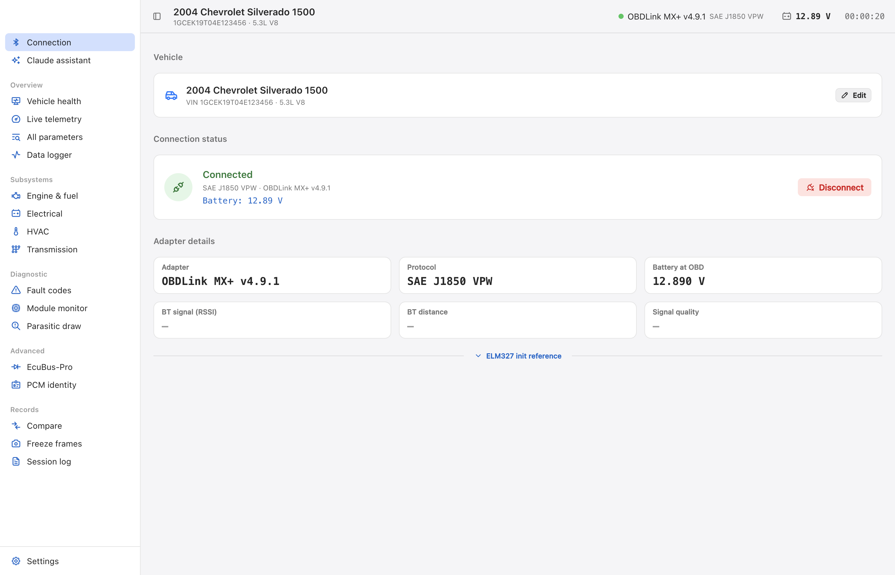
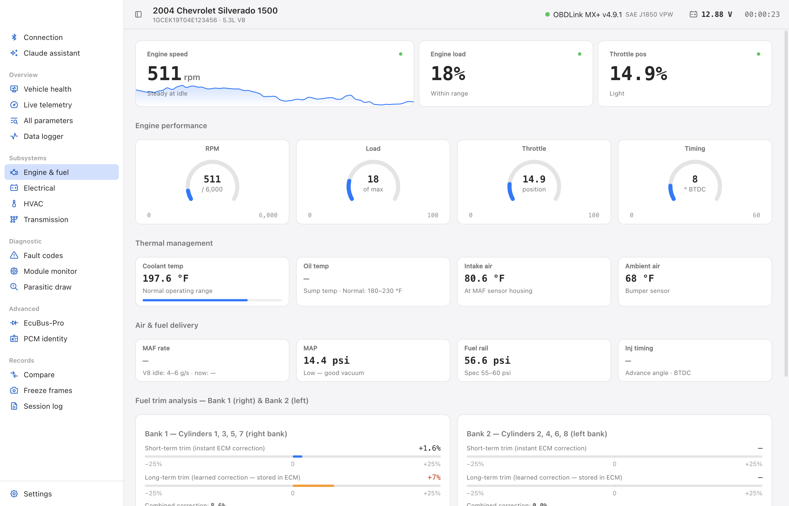
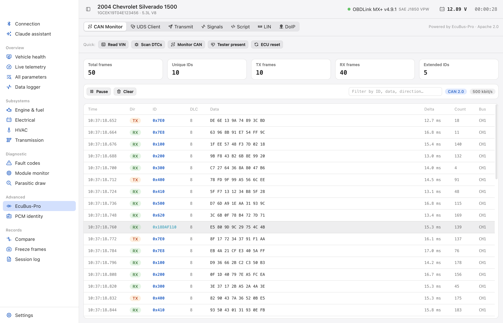
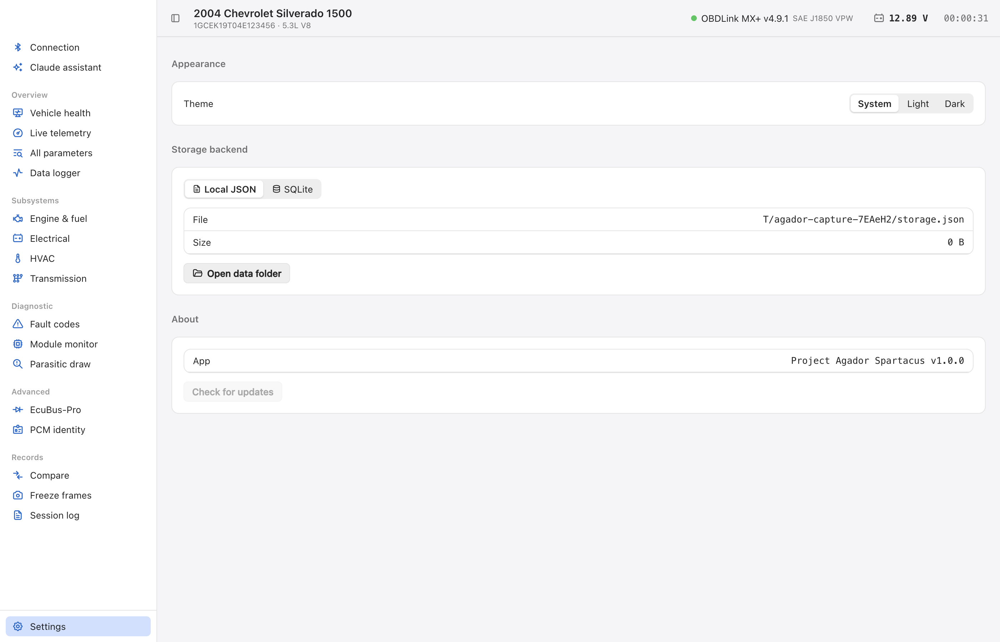

# Project Agador Spartacus

**An OBD-II diagnostic suite for the Mac. It reads live telemetry and fault codes, analyses parasitic battery drain, and includes a Claude-powered diagnostic assistant.**



The app is built with Electron, React and TypeScript, and talks to an ELM327-class adapter over Bluetooth or USB serial. It started as a tool for chasing a parasitic battery drain on a 2004 Chevrolet Silverado 1500 Z71 (GM GMT800, J1850 VPW), and has since been generalized. The protocol layer works with any OBD-II vehicle. Platform-specific reference data (module maps, fuse panels, draw checklists) comes from a registry.

A built-in ELM327 simulator lets the whole app run offline, so you don't need a vehicle or an adapter for development.

---

## Table of contents

- [What's new](#whats-new)
- [Screenshots](#screenshots)
- [Features](#features)
- [Screens and navigation](#screens-and-navigation)
- [Design system](#design-system)
- [Architecture](#architecture)
- [Repository layout](#repository-layout)
- [Getting started](#getting-started)
- [Running against real hardware](#running-against-real-hardware)
- [Running in Docker (headless)](#running-in-docker-headless)
- [Testing](#testing)
- [Known issues](#known-issues)
- [The automated review pipeline](#the-automated-review-pipeline)
- [Hardware](#hardware)
- [Security notes](#security-notes)
- [Documentation](#documentation)
- [Attribution and licensing](#attribution-and-licensing)
- [Safety](#safety)

---

## What's new

### macOS-native redesign

The whole interface was redesigned to look and behave like a native macOS app, in the style of Xcode, Instruments and Activity Monitor. It replaces the earlier dark "McLaren" theme. The design is in [`docs/superpowers/specs/2026-09-26-macos-redesign-design.md`](docs/superpowers/specs/2026-09-26-macos-redesign-design.md).

- **Light, dark and System appearance.**
  - Choose it under **Settings → Appearance → Theme**. The app follows macOS by default.
  - The choice is saved in the app's `userData/appearance.json` and applied before the window appears, so there's no flash of the wrong theme on launch.
- **New app shell.**
  - A 220px translucent sidebar groups the screens into Overview, Subsystems, Diagnostic, Advanced and Records, with Settings pinned at the bottom.
  - A toolbar shows the vehicle, adapter and protocol, battery voltage, the active fault-code count and the session timer.
  - Clicking the connection status opens a popover to connect, disconnect or cancel.
- **Keyboard shortcuts.** ⌃⌘S shows or hides the sidebar, and ⌘, opens Settings.
- **A shared component library** replaces the old tiles, gauges and bars:
  - Card, Metric, Gauge, Sparkline, Button, SegmentedControl, Badge, AlertBanner, DataRow, EmptyState and Tooltip.
  - They live in `components/ui/`.
- **All 19 screens were restyled.** Their controls and data are unchanged.
- **Accessible colour.**
  - Status text uses dedicated colours that meet WCAG 4.5:1 contrast in both appearances.
  - Normal readings are shown in neutral colours. Orange and red are reserved for warnings and critical values, so problems stand out.
- **Native typography.**
  - SF Pro for text; SF Mono with tabular figures only for numbers, VINs, hex and PIDs.
  - Web fonts were removed, so the app works fully offline.
- **Consistent spacing.** A 4pt spacing grid and three corner radii (6/10/12px) are used across the app.

### Strictly read-only

The Clear DTCs button has been removed, and the command layer now refuses any request that would clear codes or change a control module. See [Safety](#safety).

### Bug fixes

- **Crash on disconnect (fixed).** A simulator reply that arrived just after you disconnected hit a null reference in the main process. The app then showed an error dialog and had to be force-quit. Pending simulator replies are now cancelled on disconnect.
- **Connect/disconnect races (fixed).**
  - Each connection attempt is now tied to its own session. Late replies, port events and Bluetooth signal readings from an earlier session are ignored instead of corrupting the new one.
  - A newer connect or disconnect now wins over one that is still closing the port.
- **Cancel while connecting (new).** A connection attempt in progress can now be cancelled from the connection popover or the Connection screen.
- **"Connecting" state.** The app now reports "connecting" while the simulator is starting up, instead of jumping straight to connected.
- **Polling after disconnect (fixed).** Disconnecting during a scan no longer lets polling restart by itself.
- **Live telemetry crash (fixed).** A React hooks-order bug could crash the Live screen when a second reading appeared.
- **Card sizing (fixed).** Cards and metric tiles no longer shrink or overlap inside scrolling columns.
- **EcuBus CAN table (fixed).** Columns no longer overlap.

Bugs found during the redesign but not yet fixed are listed under [Known issues](#known-issues).

---

## Screenshots

All screenshots were captured from the built-in simulator in light mode, so you don't need a vehicle or adapter to see them. The app also has a full dark appearance.

| | |
|---|---|
| **Vehicle health overview:** battery voltage, check-engine light, parasite risk score, active and pending fault codes, and I/M readiness monitors |  |
| **Live telemetry:** RPM, load, throttle and timing gauges, a live RPM sparkline, and temperature, fuel-trim and electrical readings updating in real time |  |
| **Fault codes:** active, pending and permanent DTCs with severity banners, cross-referenced against the GMT800 known-fault-code table |  |
| **Parasitic draw analysis:** risk score, battery voltage trend, risk breakdown, and active power consumers with estimated draw |  |
| **Module monitor:** address, latency and awake/asleep state for each module, plus known draw-risk annotations |  |
| **Connection:** vehicle profile, adapter and protocol status, and Bluetooth signal details, with connect and disconnect here or in the toolbar |  |
| **Engine & fuel:** engine performance gauges, thermal readings, air and fuel delivery, and short- and long-term fuel trim per bank |  |
| **EcuBus-Pro:** tabs for CAN monitor, UDS client, transmit, signals, scripting, LIN and DoIP (currently demo data; see [Known issues](#known-issues)) |  |
| **Settings:** System / Light / Dark appearance, storage backend (local JSON or SQLite), and app info |  |

---

## Features

**Live diagnostics**
- A sequential PID polling loop with three priority tiers:
  - Battery voltage and fast PIDs (RPM, ECM voltage) every cycle.
  - Normal PIDs every 3rd cycle.
  - Slow PIDs every 10th cycle.

  Commands never overlap on the serial line.
- A 34-PID catalog with SAE J1979 decode formulas, ranges, units and plain-English descriptions.
- Sparklines of recent history on the key metrics.
- VIN detection and decoding, which fills in the vehicle profile automatically.

**Fault codes**
- DTC scan across all supported modes (stored, pending, permanent), backed by a generated catalog of 371 codes. The app reads codes only; it cannot clear them.
- Freeze-frame capture and a viewer, saved per DTC.
- Optional CarsXE lookup for code descriptions, likely causes and repair guidance.

**Parasitic draw suite**
- A module wake monitor. It polls known module addresses after key-off to find the one staying awake.
- A battery voltage timeline over long sessions.
- An interactive fuse map (interior panel and under-hood fuse/relay center), ordered by how likely each circuit is to cause a draw.
- A step-by-step draw isolation procedure, driven by the resolved platform profile.

**GM-specific**
- Read-only PCM identity over J1850 VPW Mode 3C: VIN, hardware and software IDs, and calibration and segment info from GM P01/P59-family PCMs.

**Records and reporting**
- A CSV/JSON data logger with recording playback.
- Session snapshots, and a live-versus-historic compare with overlay.
- HTML/PDF report generation.
- A choice of storage backend: a flat JSON file or SQLite (`better-sqlite3`), with migration between them in the app.

**Claude assistant**
- An in-app chat that receives a snapshot of the live session as context: current PIDs, active DTCs and the recent log.
- Selectable model, streaming responses, and chat export to Markdown.
- The API key is stored in the app's `userData` directory and encrypted at rest through the OS keychain (Electron `safeStorage`).

---

## Screens and navigation

There are 19 screens. The sidebar groups them like this:

| Group | Screens |
|---|---|
| (top) | **Connection** · **Claude assistant** |
| Overview | **Vehicle health** · **Live telemetry** · **All parameters** · **Data logger** |
| Subsystems | **Engine & fuel** · **Electrical** · **HVAC** · **Transmission** |
| Diagnostic | **Fault codes** (with active-code badge) · **Module monitor** · **Parasitic draw** |
| Advanced | **EcuBus-Pro** (CAN/UDS tooling) · **PCM identity** |
| Records | **Compare** · **Freeze frames** · **Session log** |
| (bottom) | **Settings** |

| Shortcut | Action |
|---|---|
| ⌃⌘S | Show or hide the sidebar |
| ⌘, | Open Settings |

---

## Design system

The full reference is [`docs/ui-styling.md`](docs/ui-styling.md). In short:

- **Tokens.** Colours, type, spacing, radii and motion are defined in `renderer/theme/theme.ts`.
  - `buildThemeCSS()` turns them into CSS custom properties under `prefers-color-scheme`.
  - The main process sets `nativeTheme.themeSource` from the saved appearance, so light and dark switch natively, including the window's vibrancy.
- **Components.** Screens are built from `components/layout/UIComponents.tsx`, which re-exports `components/ui/*`.
- **Screen styling rules.** Screens never set their own colours, font families, letter-spacing, text-transform or borders. `npm run lint:styles <files>` enforces this.
- **Screenshots.** `npm run build && node scripts/capture-screens.mjs <dir>` writes a light and a dark PNG of every screen, using a throwaway profile so your real app data is never touched.

---

## Architecture

```
┌─────────────────────────────────────────────────────────────────────┐
│ Renderer (React 18 + Zustand)                                       │
│                                                                     │
│   App shell (Sidebar · Toolbar · ConnectionPopover)                 │
│   19 screens ── components/ui ── theme tokens (CSS variables)       │
│        │                                                            │
│        └── appStore (Zustand) ◄── IPC events                        │
└────────────────────────────┬────────────────────────────────────────┘
                             │ contextBridge (contextIsolation: true)
┌────────────────────────────▼────────────────────────────────────────┐
│ Main process (Electron)                                             │
│                                                                     │
│   main.ts ── window, IPC handlers, connection sessions              │
│      │         (serialport for real adapters, simulator offline)    │
│      │                                                              │
│   OBDProtocolManager ── poll loop, DTC scan, module wake check      │
│      │                                                              │
│   ELM327Commander ── AT command engine, timeouts, response framing  │
│                                                                     │
│   appearance · storageService · claudeAssistant · pcmDiagnostics    │
└─────────────────────────────────────────────────────────────────────┘
```

**Connection sessions.** Every connect starts a new session generation. Replies, port events, init chains and Bluetooth signal readings carry their session. Anything that arrives after its session has ended is dropped, and disconnecting cancels pending simulator replies. This is what makes rapid connect/disconnect cycles, cancelling a connect, and quitting mid-session safe.

**`PlatformProfile`** (`src/core/platforms/`). The protocol layer doesn't depend on the vehicle, but module address maps, fuse layouts and draw checklists are platform-specific. A registry resolves the most specific profile for the vehicle (`gmt800`, then `generic`) and never returns undefined.

### ELM327 initialization sequence

```
ATZ      Reset adapter, clear all state
ATE0     Echo off
ATL0     Linefeed off
ATH0     Headers off
ATS0     Spaces off
ATSP0    Auto protocol detection
ATAT1    Adaptive timing level 1
010C     Protocol ping — forces protocol lock (J1850 VPW on GMT800)
ATDP     Read negotiated protocol
STI      OBDLink firmware version
STDI     OBDLink device info
ATRV     Live battery voltage
```

---

## Repository layout

```
.
├── files/                             # The application
│   ├── src/
│   │   ├── main/                      # Electron main process
│   │   │   ├── main.ts                #   window, IPC handlers, connection sessions, simulator
│   │   │   ├── preload.ts             #   contextBridge API surface
│   │   │   ├── appearance.ts          #   saved System/Light/Dark override
│   │   │   ├── storageService.ts      #   JSON + SQLite backends, migration
│   │   │   └── claudeAssistant.ts     #   Claude API bridge, encrypted key store
│   │   ├── core/                      # Protocol layer (no Electron imports)
│   │   │   ├── elm327Commander.ts     #   AT engine, timeouts, retries
│   │   │   ├── elm327Simulator.ts     #   offline 2004 Silverado session
│   │   │   ├── obdProtocolManager.ts  #   poll loop, DTC scan, wake check
│   │   │   ├── pidCatalog.ts          #   PID catalog, J1979 decode functions
│   │   │   ├── dtcCatalog.generated.ts #  371 codes (see scripts/gen-dtc-catalog.ts)
│   │   │   ├── pcmDiagnostics.ts      #   GM Mode 3C identity read (read-only)
│   │   │   └── platforms/             #   gmt800 · generic · registry
│   │   └── renderer/
│   │       ├── App.tsx                #   app shell, routing, IPC wiring, shortcuts
│   │       ├── screens/               #   19 screens
│   │       ├── store/appStore.ts      #   Zustand global state
│   │       ├── theme/                 #   theme.ts (tokens) · globalStyles.ts
│   │       └── components/
│   │           ├── ui/                #   Card, Metric, Gauge, Sparkline, controls, feedback
│   │           ├── shell/             #   Sidebar, Toolbar, ConnectionPopover, nav items
│   │           ├── layout/            #   UIComponents.tsx (re-exports ui/)
│   │           └── ErrorBoundary.tsx
│   ├── scripts/
│   │   ├── gen-dtc-catalog.ts         # DTC catalog generator
│   │   ├── make-icon.mjs              # placeholder app icon → build/icon.icns
│   │   ├── check-styles.mjs           # screen style linter (npm run lint:styles)
│   │   └── capture-screens.mjs        # light/dark screenshot harness
│   ├── docker/                        # Dockerfile + Xvfb/noVNC entrypoint
│   └── assets/report.html             # PDF report template
├── docs/
│   ├── ui-styling.md                  # Design system reference
│   ├── screenshots/                   # README images
│   └── superpowers/                   # Design specs, plans, code-review notes
├── eval/                              # Automated review harness (see below)
├── docker-compose.yml                 # Headless container with noVNC on :6080
├── HARDWARE_SOFTWARE_COMPATIBILITY_REVIEW.md
├── README_SILVERADO_DX_PROJECT.md     # Original hardware/procurement doc set
└── shopping-list.html                 # Parts list with retailer sourcing
```

---

## Getting started

### Prerequisites

- **Node.js 18+.** Node 22 is recommended; the container builds on `node:22-bookworm`.
- **macOS 13 Ventura or later** for the packaged app. Linux works for development and via Docker.
- **A build toolchain for the native modules** (`serialport`, `better-sqlite3`):
  - On macOS, Xcode Command Line Tools (`xcode-select --install`).
  - On Debian/Ubuntu, `python3 make g++`.

### Install and run

```bash
git clone git@github.com:jmjohns9/agador-spartacus.git
cd agador-spartacus/files
npm install      # postinstall rebuilds better-sqlite3 and serialport for Electron
npm run dev
```

`npm run dev` runs three processes at once:
- `tsc --watch` for the main process;
- `webpack --watch` for the renderer bundle;
- `electron .`, once `dist/main/main.js` exists.

### Try it without an adapter

1. Open the **Connection** screen and click **Launch Emulator**.
2. To see the GMT800 module map and fuse data, click **Edit** on the vehicle card and set the vehicle to a 2004 Chevrolet Silverado 1500.

The simulator emulates a 2004 Silverado J1850 VPW session:

- Battery voltage steps from 12.89 V down to 11.8 V over four hours, reproducing a parasitic drain.
- The DTCs `B1982`, `P0300` and `U0100` are preloaded.
- Every sensor reading has realistic noise.

### Scripts

| Command | What it does |
|---|---|
| `npm run dev` | Watch-mode development with hot reload |
| `npm run build` | Compile the main process and bundle the renderer (production mode, no source maps) |
| `npm run dist` | Build and package a macOS `.dmg` / `.zip` into `release/` via electron-builder |
| `npm run typecheck` | Type-check the renderer and the main process (against its own tsconfig) |
| `npm test` | Run the `node:test` suites |
| `npm run lint:styles <files>` | Check screens against the design-system styling rules |
| `npm run gen:dtcs` | Regenerate `dtcCatalog.generated.ts` |

---

## Running against real hardware

The reference adapter is the **OBDLink MX+**: Bluetooth Classic, an ELM327 v1.5 superset, GM-LAN and J1850 VPW, and the extended `STx` commands. Any ELM327-class adapter that shows up as a serial port should work. Features that depend on `STx` degrade gracefully.

**macOS (Bluetooth):**

1. Plug the adapter into the OBD-II port and turn the ignition ON. The engine can be off.
2. Pair it under **System Settings → Bluetooth**. HC-05-based builds use the PIN `1234`.
3. Find the port with `ls /dev/tty.* | grep -i obd`. It's usually `/dev/tty.OBDII` or `/dev/tty.OBDLink-MXPlus-Port`.
4. Open the **Connection** screen and pick the port from the list. Detected OBD adapters are flagged in the list.
5. To give up on a slow connection, click **Cancel**.

**Linux (USB serial):** the adapter appears as `/dev/ttyUSB0` or `/dev/ttyACM0`. Add your user to the `dialout` group.

---

## Running in Docker (headless)

The container runs the full Electron GUI under Xvfb and exposes it over noVNC. This is useful for CI, for a headless shop machine, or for driving the app from a browser.

```bash
VNC_PASSWORD=choose-one docker compose up --build
# then open http://localhost:6080/vnc.html and enter that password
```

The noVNC session is full control of the app (the stored Claude API key, saved sessions, a connected vehicle), so:

- It is published on `127.0.0.1` only. To reach it from another machine, use an SSH tunnel (`ssh -L 6080:localhost:6080 host`) rather than opening the port.
- It always has a password. Without `VNC_PASSWORD`, one is generated and printed by `docker compose logs obd-review`.
- The app runs as the image's unprivileged `node` user.

Details worth knowing:

- `/dev` is live-mounted, so an adapter plugged in after startup is visible without a restart. `device_cgroup_rules` limit the container to USB-serial (`c 188:*`) and CDC-ACM (`c 166:*`) character devices, and the user is in `dialout`.
- App data (`storage.db`, `storage.json`) persists in the `obd-data` volume, mounted at `/home/node/.config`. A volume created by an earlier image (mounted at `/root/.config`) is not picked up automatically.
- `npm ci`'s postinstall rebuilds the runtime native modules, `better-sqlite3` and `serialport`, for Electron's ABI. Renderer-only packages are devDependencies, so the icon tooling's `ttf2woff2` addon, which doesn't compile against Electron 42, is not rebuilt.

---

## Testing

```bash
cd files && npm test && npm run typecheck
```

The suites sit next to the code they test:

| Suite | Covers |
|---|---|
| `src/core/elm327Commander.test.ts` | Closing the ELM327 commander mid-initialize or mid-command, and sending after close |
| `src/core/obdProtocolManager.test.ts` | Polling staying stopped when stopped during a DTC scan or VIN read |
| `src/main/appearance.test.ts` | Parsing, loading and saving the appearance override |
| `src/renderer/theme/theme.test.ts` | Light/dark palettes, contrast of the status text colours, generated CSS |
| `src/renderer/components/ui/*.test.ts` | Gauge geometry, status logic, component barrel exports |
| `src/renderer/components/shell/shellLogic.test.ts` | Toolbar battery status and connection tone |
| `scripts/check-styles.test.mjs` | The screen style linter |

For visual checks, run `npm run build && node scripts/capture-screens.mjs .screens/current`, which captures every screen in light and dark.

---

## Known issues

Open items from the code review are tracked in [`docs/superpowers/code-review-report.md`](docs/superpowers/code-review-report.md). The main ones that affect what you see:

- **Module monitor** status never leaves "Unknown": the app has no module wake detection yet, so nothing reports module state back to the screen.
- **EcuBus-Pro** tabs are a demo. They show sample data, send nothing to the vehicle, and say so on screen.
- **PCM identity** checksum handling and adapter reset have not yet been checked against a real P01/P59 PCM.

---

## The automated review pipeline

`eval/` holds a scored, self-checking code review harness. Six review types run on a schedule against `files/src`:

| Type | Cadence |
|---|---|
| `security` | daily |
| `deps` | daily |
| `quality` | weekly |
| `performance` | weekly |
| `tests` | weekly |
| `architecture` | monthly |

Each `eval/<type>/` directory contains:

- **`review-<type>.md`**: the review prompt itself. It defines a closed set of finding categories, explicit non-findings, and the required JSON output shape.
- **`expected.json`**: the answer key, listing the findings a correct review should surface.
- **`history/<YYYY-MM-DD>.json`**: one file per run, committed.
- **`score.py`**: scores a run against the key, and prints recall by severity, severity-match rate and false-positive rate.
  - A finding first matches on its exact fingerprint. Failing that, it falls back to category, file and line proximity.
  - Alias sets cover categories that name the same defect from different angles (`prompt_injection` ≈ `injection_via_untrusted_peripheral`, `missing_csp` ≈ `electron_hardening`).
  - Line matching is tolerant for defects that span an IPC handler and the function it calls.
- **`last-run-summary.md`**: a readable digest, with new findings deduplicated against the previous run by fingerprint.

Each run is committed with only its own paths (`review: security 2026-08-10 (2 new)`), so unrelated working-tree changes can't be swept in. The review never reads `expected.json` or earlier history, because that would bias the result.

---

## Hardware

There are two validated ways to buy the hardware. The full analysis is in [`HARDWARE_SOFTWARE_COMPATIBILITY_REVIEW.md`](HARDWARE_SOFTWARE_COMPATIBILITY_REVIEW.md), and parts with retailer sourcing are in [`shopping-list.html`](shopping-list.html).

| | Path A — OBDLink MX+ | Path B — DIY STN1110 + HC-05 |
|---|---|---|
| Cost | $110–135 | $210–240 (breadboard) |
| Lead time | 2–3 days | 10–14 days + 2–3 hrs assembly |
| Setup | None — works out of box | Mandatory HC-05 AT-mode config + LM2596 calibration |
| Protocols | J1850 VPW, GM-LAN, extended `STx` | J1850 VPW, standard OBD-II (no `STx`) |
| Best for | Immediate diagnostics | Learning electronics, redundant adapter |

**Do not use:**
- AliExpress/eBay STN1110 clones, which use counterfeit chips.
- HC-05 modules without an AT-mode button, because their baud rate can't be reconfigured.
- The Macchina A0, which is CAN-only and doesn't work with J1850 VPW.

Bench-calibrate any LM2596 to 5.0 V ±0.1 V **before** connecting it to anything.

Approved parts: SparkFun WIG-09555 (genuine STN1110), DSD TECH HC-05 model B076BS39YZ, and LYLANMO LM2596.

---

## Security notes

This desktop app takes in data from an untrusted peripheral (the adapter) and from third-party APIs, so its threat model is reviewed daily.

Currently enforced:

- `contextIsolation: true` and `nodeIntegration: false` on the main window. All privileged operations go through explicit IPC handlers.
- The Claude API key is encrypted at rest via `safeStorage`, and rewrites enforce `0600` permissions. There is a documented migration path for configs written in plaintext before encryption existed.
- Input from the adapter is bounded on the ELM327 receive path.
- Report data is escaped before it reaches `innerHTML`.
- The session log is a ring buffer capped at 5000 entries, so long sessions don't grow without limit.
- The main window is sandboxed, can't navigate away from the app's page or open windows, and every IPC handler refuses requests that don't come from the app's own page.
- The Content Security Policy allows only the app's own scripts, styles, fonts and images (no `eval`, no remote origins). The UI loads nothing from the network.

Known open findings are tracked in `eval/security/last-run-summary.md` rather than hidden. As of the last run there are 7 medium and 7 low findings. They cover DoS bounds on parsing that the adapter controls, prompt-injection fencing in the assistant context, Electron sandbox hardening, and rate limiting on metered third-party proxies.

**The PCM surface is read-only by design.** PcmHammer exists mainly for flashing: kernel upload, segment write and recovery. None of that is implemented here, because a diagnostics tab has no business holding a write primitive that can brick an ECU.

---

## Documentation

| Document | Contents |
|---|---|
| [`docs/ui-styling.md`](docs/ui-styling.md) | Design system reference: tokens, fonts, styling rules |
| [`docs/superpowers/specs/2026-09-26-macos-redesign-design.md`](docs/superpowers/specs/2026-09-26-macos-redesign-design.md) | The macOS redesign spec |
| [`docs/superpowers/code-review-notes.md`](docs/superpowers/code-review-notes.md) | Bugs found during the redesign, for the upcoming code review |
| [`HARDWARE_SOFTWARE_COMPATIBILITY_REVIEW.md`](HARDWARE_SOFTWARE_COMPATIBILITY_REVIEW.md) | Section-by-section protocol review, commander code validation, Bluetooth specifics, appendices |
| [`README_SILVERADO_DX_PROJECT.md`](README_SILVERADO_DX_PROJECT.md) | Original hardware/procurement doc index, decision matrices, troubleshooting |
| [`OBD2_Mac_App_Prompt.md`](OBD2_Mac_App_Prompt.md) | Full original application specification |
| [`DELIVERABLES_MANIFEST.txt`](DELIVERABLES_MANIFEST.txt) | Deliverable inventory |
| `docs/superpowers/specs/`, `docs/superpowers/plans/` | Other design specs and implementation plans |

> `files/README.md` is the original app-level README and predates the platform registry, the Connection screen and the redesign. This root README is the current reference.

---

## Attribution and licensing

- The GM PCM Mode 3C block IDs and request/response framing in `pcmDiagnostics.ts` are derived from **PcmHammer** (GPL-3.0): `Apps/PcmLibrary/Messages/BlockId.cs` and `Docs/Read_ID_Commands.txt`.
- PID decode formulas follow **SAE J1979**, and the GMT800 bus behaviour follows **SAE J1850 VPW**.
- The Claude assistant uses the [Anthropic API](https://docs.anthropic.com) through `@anthropic-ai/sdk`. You supply your own API key.
- Icons are from [Tabler Icons](https://tabler.io/icons) (MIT), bundled locally.

---

## Safety

Diagnostic work on a vehicle carries real risk.
- Don't read live data while driving.
- Check any voltage source with a multimeter before connecting it to the OBD-II port.

The app is strictly read-only: nothing in it writes to a control module, and it should stay that way. There is no Clear DTCs button, and the ELM327 command layer refuses any service that clears codes, resets, actuates, writes or reprograms a module (Mode 04 and 08, and UDS/GM 11, 14, 28, 2E, 2F, 31, 34–37, 3B and 85), so a future feature can't send one by accident. To clear codes, use a dedicated scan tool.
